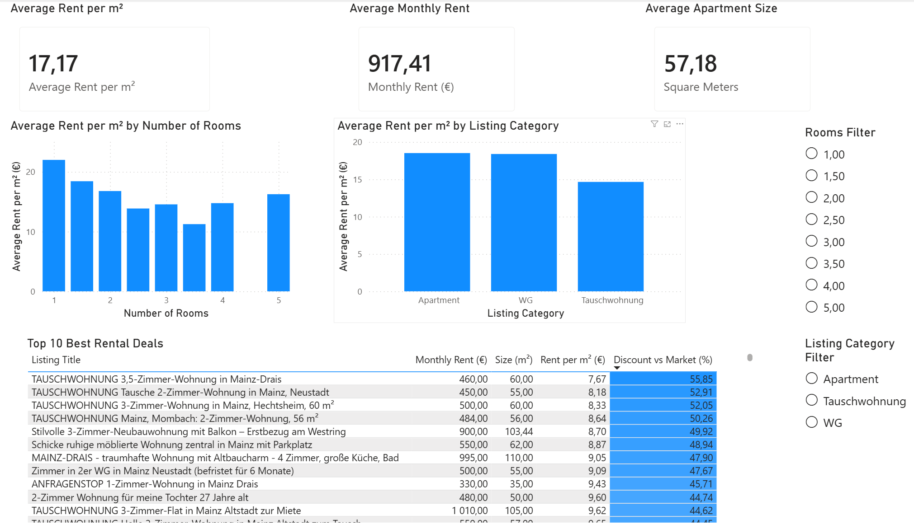

AI-Powered Real Estate Analytics Platform
Overview

This project analyzes the rental housing market in Mainz, Germany using data collected from Kleinanzeigen.

The platform automatically scrapes rental listings, enriches property data, calculates market metrics, identifies potentially undervalued apartments, and visualizes insights through an interactive Power BI dashboard.

## Projektzusammenfassung (Deutsch)

Entwicklung einer End-to-End Data Analytics Lösung zur Analyse des Mietwohnungsmarktes in Mainz.

Der Workflow umfasst Web Scraping mit Python, Datenbereinigung, Feature Engineering, PostgreSQL, SQL-Analysen sowie die Erstellung eines interaktiven Power BI Dashboards zur Identifikation attraktiver Mietangebote.

Business Problem

Finding affordable rental apartments in Germany is difficult because rental prices vary significantly by property type, apartment size, and location.

The goal of this project is to transform raw rental listings into actionable market insights and help identify listings priced below the market average.

Project Goals
Collect rental listings from Kleinanzeigen
Enrich listings with apartment size and room count
Store data in PostgreSQL
Perform SQL-based market analysis
Calculate rent per square meter
Detect potentially undervalued listings
Build an interactive Power BI dashboard
Tech Stack
Python
Pandas
BeautifulSoup
Requests
PostgreSQL
SQL
Power BI
Git
GitHub
Architecture

Kleinanzeigen
↓
Python Scraping Pipeline
↓
Data Cleaning & Feature Engineering
↓
PostgreSQL Database
↓
SQL Analytics Layer
↓
Power BI Dashboard

## Dashboard Preview

Dataset Summary
Final Dataset
248 rental listings collected
220 listings successfully enriched and analyzed
Invalid listings and obvious data-entry errors removed
Missing values handled during cleaning
Feature Engineering

The following analytical features were created:

price_per_m2
deal_score
discount_percent
## Market Insights (Mainz)

### Overall Market

| Metric                 |    Value |
| ---------------------- | -------: |
| Listings Analyzed      |      220 |
| Average Monthly Rent   |  €917.41 |
| Average Apartment Size | 57.18 m² |
| Average Rent per m²    |   €17.17 |

### Rental Categories

| Category      | Listings | Average Rent per m² (€) |
| ------------- | -------: | ----------------------: |
| Apartment     |      132 |                   18.52 |
| WG            |        9 |                   18.39 |
| Tauschwohnung |       75 |                   14.65 |

### Room Analysis

| Rooms | Average Rent per m² (€) |
| ----- | ----------------------: |
| 1     |                    22.0 |
| 1.5   |                    18.5 |
| 2     |                    16.8 |
| 2.5   |                    13.9 |
| 3     |                    14.5 |
| 4     |                    14.8 |
| 5     |                    16.2 |

### Key Findings

* 220 rental listings were successfully enriched and analyzed.
* Apartments represent the largest market segment with 132 listings.
* Small apartments command the highest rent per square meter.
* WG listings have a similar rent per square meter to standard apartments despite lower total monthly costs.
* Tauschwohnung listings are approximately 21% cheaper per square meter than standard apartment rentals.
* Multiple listings were identified as potential below-market opportunities using a custom deal scoring model.

The platform identifies potentially undervalued rental listings using a custom scoring model.

Deal Score
Deal Score =
Market Average Rent per m²
-
Listing Rent per m²
Interpretation
Positive score → below-market listing
Negative score → above-market listing
Higher score → potentially better deal
Discount Percentage
Discount % =
(Market Average - Listing Price per m²)
/
Market Average × 100

This allows quick identification of attractive rental opportunities.

Dashboard Features

The Power BI dashboard includes:

Average Rent per m² KPI
Average Monthly Rent KPI
Average Apartment Size KPI
Rent per m² by Number of Rooms
Rent per m² by Listing Category
Top 10 Best Rental Deals
Interactive filters for:
Number of Rooms
Listing Category
Data Quality Notes

The project automatically removes:

Listings with missing apartment size
Listings with invalid room counts
Listings with zero apartment size
Promotional and obvious data-entry errors
Non-market outlier records

This ensures more reliable market analysis and deal detection.

Future Improvements
District-level rental analysis
Time-series market tracking
Automated data refresh pipeline
Rental price prediction model
Interactive web dashboard
Dashboard Preview

(Add Power BI dashboard screenshot here)

images/dashboard.png
Project Status

Version 1 (MVP) In Progress